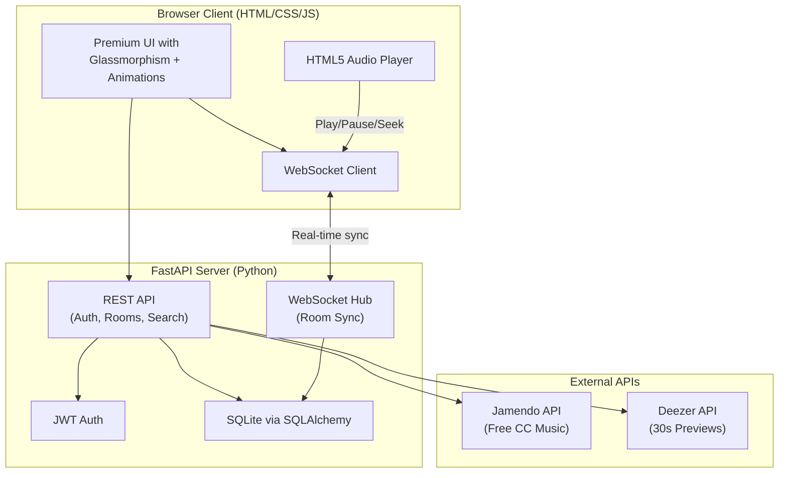

# 🎵 JamSync — Free Collaborative Music Listening App

A real-time synchronized music listening room app built with **FastAPI + WebSockets** and a stunning modern frontend. Users can create rooms, invite friends, and listen to the same song at the same time — like a virtual DJ room.

## Architecture Overview



## Music Source Strategy

| API | What We Get | Limitations | Use Case |
|-----|------------|-------------|----------|
| **Jamendo** | Full-length CC-licensed tracks, streaming URLs, album art, genres | Need free API client ID (instant registration) | Primary music source — 600k+ free tracks |
| **Deezer** | 30-second preview URLs for any track, massive catalog | Only 30s previews without auth | Discovery & previews of popular/mainstream music |

> [!IMPORTANT]
> **Jamendo** is the primary source — it provides **full-length free tracks** under Creative Commons licenses. Deezer is supplementary for discovering mainstream artists (30s previews only). Users will need to register at [developer.jamendo.com](https://developer.jamendo.com) for a free Client ID.

## User Review Required

> [!IMPORTANT]
> **Jamendo API Key**: You'll need to register (free) at [developer.jamendo.com](https://developer.jamendo.com) to get a Client ID. This takes ~2 minutes. Should I proceed assuming you'll get one, or would you prefer I build a mock/demo mode that works without an API key first?

> [!WARNING]
> **Deployment**: Free-tier hosting (Render/Railway) may have cold-start delays of 30-60 seconds. WebSocket connections may also time out on free tiers. This is acceptable for a personal/small-scale project but worth noting.

## Open Questions

1. **App Name**: I'm going with **"JamSync"** — want a different name?
2. **Max Room Size**: How many simultaneous listeners per room? (I'll default to 20)
3. **Chat**: Should rooms have a text chat alongside the music player? (I'll include it by default)

---

## Proposed Changes

### Project Structure

```
jamsync/
├── backend/
│   ├── main.py                 # FastAPI app entry point
│   ├── config.py               # Settings & env vars
│   ├── database.py             # SQLAlchemy setup
│   ├── models.py               # DB models (User, Room, Playlist)
│   ├── schemas.py              # Pydantic schemas
│   ├── auth.py                 # JWT auth utilities
│   ├── routers/
│   │   ├── auth_routes.py      # Login/Register endpoints
│   │   ├── room_routes.py      # Room CRUD endpoints
│   │   ├── music_routes.py     # Music search/stream proxy
│   │   └── playlist_routes.py  # User playlist management
│   ├── services/
│   │   ├── jamendo.py          # Jamendo API client
│   │   ├── deezer.py           # Deezer API client
│   │   └── room_manager.py     # WebSocket room sync logic
│   ├── requirements.txt
│   └── static/                 # Served frontend files
│       ├── index.html
│       ├── app.js
│       ├── styles.css
│       └── assets/
├── render.yaml                 # Render deployment config
├── Procfile                    # Alternative deploy config
├── .env.example                # Environment template
└── README.md
```

---

### Component 1: Backend Core

#### [NEW] backend/main.py
- FastAPI app with CORS, static file serving, WebSocket endpoint
- Lifespan handler for DB initialization
- Mount static files for the frontend

#### [NEW] backend/config.py
- Pydantic Settings for env vars (JWT secret, Jamendo client ID, DB URL)

#### [NEW] backend/database.py
- SQLAlchemy async engine with SQLite (`jamsync.db`)
- Session factory and Base model

#### [NEW] backend/models.py
- `User` — id, username, email, hashed_password, avatar_url, created_at
- `Room` — id, name, code (6-char invite), creator_id, is_active, created_at
- `Playlist` — id, user_id, name, tracks (JSON field)
- `RoomHistory` — id, room_id, track_data, played_at

#### [NEW] backend/schemas.py
- Pydantic models for request/response validation

#### [NEW] backend/auth.py
- Password hashing (bcrypt via passlib)
- JWT token creation/verification
- `get_current_user` dependency

---

### Component 2: API Routers

#### [NEW] backend/routers/auth_routes.py
- `POST /api/auth/register` — Create account
- `POST /api/auth/login` — Get JWT token
- `GET /api/auth/me` — Get current user profile

#### [NEW] backend/routers/room_routes.py
- `POST /api/rooms` — Create a new room (generates invite code)
- `GET /api/rooms` — List public rooms
- `GET /api/rooms/{code}` — Get room details by invite code
- `DELETE /api/rooms/{id}` — Delete room (owner only)

#### [NEW] backend/routers/music_routes.py
- `GET /api/music/search?q=...&source=jamendo` — Search tracks
- `GET /api/music/trending` — Get trending/popular tracks
- `GET /api/music/genres` — List available genres
- `GET /api/music/stream/{track_id}` — Proxy stream URL

#### [NEW] backend/routers/playlist_routes.py
- `GET /api/playlists` — User's playlists
- `POST /api/playlists` — Create playlist
- `PUT /api/playlists/{id}` — Add/remove tracks
- `DELETE /api/playlists/{id}` — Delete playlist

---

### Component 3: Services (Business Logic)

#### [NEW] backend/services/jamendo.py
- Async HTTP client for Jamendo API v3.0
- Search tracks, get track details, streaming URLs
- Genre listing, trending tracks

#### [NEW] backend/services/deezer.py
- Async HTTP client for Deezer public API
- Search tracks, get 30s preview URLs
- Artist/album metadata

#### [NEW] backend/services/room_manager.py
- **`RoomManager`** class — singleton managing all active rooms
- Each room tracks: connected clients, current track, playback position, play/pause state
- WebSocket message types:
  - `join_room` / `leave_room`
  - `play_track` — host selects a track, all clients receive it
  - `sync_playback` — periodic time sync (every 2s)
  - `pause` / `resume` / `seek` — host controls, broadcast to all
  - `chat_message` — text chat within room
  - `queue_track` — add to room queue
- **Sync Algorithm**: Server maintains authoritative playback timestamp. Clients adjust their local `currentTime` if drift > 0.5s.

---

### Component 4: Frontend (Premium UI)

#### [NEW] backend/static/index.html
Single-page app with these views (toggled via JS routing):
- **Landing Page** — Hero section with animated gradient background, feature cards
- **Auth Modal** — Glassmorphism login/register forms
- **Dashboard** — Room list, create room, trending music
- **Room View** — Full music player, synchronized playback, chat panel, user list
- **Profile** — User playlists, listening history

#### [NEW] backend/static/styles.css
Premium design system:
- Dark mode with deep navy/purple gradient backgrounds
- Glassmorphism cards (backdrop-filter: blur)
- Neon accent colors (electric blue `#00D4FF`, vibrant purple `#7B2FFF`, hot pink `#FF2D78`)
- Smooth micro-animations (fade-in, slide-up, pulse on hover)
- Custom audio player with gradient progress bar
- Responsive grid layouts
- Google Font: Inter / Outfit

#### [NEW] backend/static/app.js
- SPA router (hash-based)
- WebSocket connection manager with auto-reconnect
- Audio player controller with sync logic
- Fetch-based API client with JWT token management
- Room chat with auto-scroll
- Search with debounced input
- Playlist management UI

---

### Component 5: Deployment

#### [NEW] render.yaml
- Web service config for Render free tier
- Environment variables, build/start commands

#### [NEW] Procfile
- `web: uvicorn backend.main:app --host 0.0.0.0 --port $PORT`

#### [NEW] .env.example
- Template with required environment variables

#### [NEW] README.md
- Setup instructions, feature list, screenshots

---

## Verification Plan

### Automated Tests
1. Start the FastAPI server locally: `uvicorn backend.main:app --reload`
2. Test auth flow: Register → Login → Access protected endpoints
3. Test music search: Search Jamendo API and verify results
4. Test WebSocket sync: Open two browser tabs, join same room, verify synchronized playback
5. Test room creation with invite codes

### Manual Verification
1. Visual inspection of UI in browser — ensure premium design renders correctly
2. Test responsive design at mobile/tablet/desktop breakpoints
3. Test the full user flow: Register → Create Room → Search Music → Play Track → Invite friend (second tab) → Verify sync
4. Test chat functionality within rooms

---

## Tech Stack Summary

| Layer | Technology |
|-------|-----------|
| Backend Framework | FastAPI (Python 3.10+) |
| Real-time | WebSockets (native FastAPI) |
| Database | SQLite + SQLAlchemy |
| Auth | JWT (python-jose) + bcrypt (passlib) |
| HTTP Client | httpx (async) |
| Music API | Jamendo (primary) + Deezer (secondary) |
| Frontend | Vanilla HTML/CSS/JS |
| Deployment | Render.com (free tier) |
